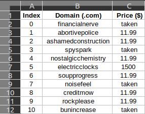

# GoDaddy Scraper

 
A Node.js script for retrieving domains and prices of randomly generated names.

The script guides you through generating random names in accordence to your preferences, then it lets your scrape these names from https://www.godaddy.com/ and saves the results to a CSV file.

## Usage
### npm start
Runs through <b><i>domains-names-generator.js</i></b> and then immidiately runs <b><i>scraper.js</i></b>.

You can also run them separately: 
 
 
<i>node domain-names-generator</i>
 
<i>node scraper</i>
 
Beware not to scrape more than 250 domains at a time, you'll get a "Too many requests" error from the server.

