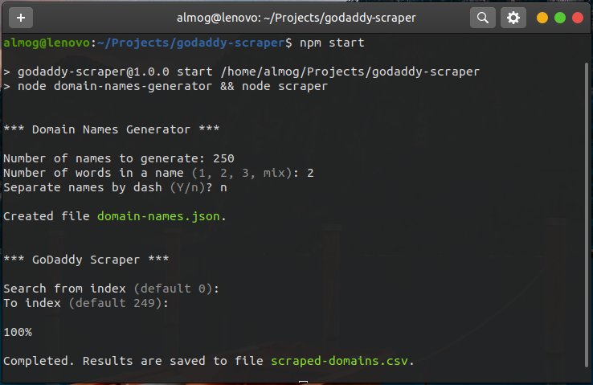

# GoDaddy Scraper

 
A Node.js script for retrieving domains and prices of randomly generated names.

The script guides you through generating random names in accordence to your preferences, then it lets your scrape these names from https://www.godaddy.com/ and saves the results to a CSV file.

## Usage

### `npm start`

Generates random domain names and starts scraping them.

### `npm run scrape`

Scrapes an already created list of domain names. 

Beware that if you try to scrape more than 250 domains at a time you'll get a "Too many requests" error from the server.

